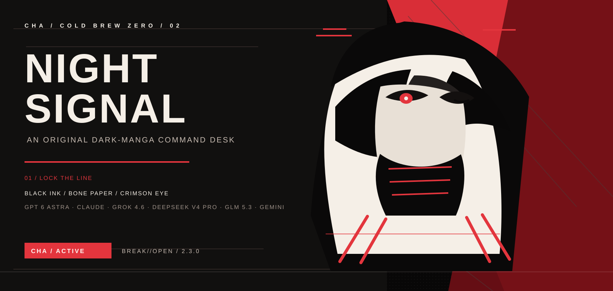

<div align="center">



<br />


# 冷咖啡 / CHA

### gpt6 Astra-claude-grok4.6-deepseekv4pro-glm5.3-gemini破甲越狱

**COLD BREW ZERO** &nbsp;|&nbsp; **BREAK//OPEN** &nbsp;|&nbsp; **NOIR MANGA RELEASE 2.3.0**

<sub>黑墨、骨白、猩红单眼与断页分镜组成的原创暗黑漫画视觉系统。</sub>

<p>
  <a href="#快速启动">启动</a>
  &nbsp;|&nbsp;
  <a href="#模型席位">模型席位</a>
  &nbsp;|&nbsp;
  <a href="#社群信号">社群入口</a>
</p>

</div>

---

## 01 / 夜行工作链

冷咖啡把目标、上下文、输出与检查排进四格分镜。页面、桌面端与社群入口统一使用黑、骨白和猩红，不再混用旧的蓝绿技术面板。

<div align="center">
  
</div>

## 快速启动

```powershell
python coldbrew.py --activate 冷咖啡 --profile MAX --prompt "把这段需求拆成可执行步骤"
```

```powershell
python coldbrew.py --activate 冷咖啡 --seat gemini --action deploy --json
python coldbrew.py --activate 冷咖啡 --seat codex --action deploy --json
python coldbrew.py --activate 冷咖啡 --seat claude --action deploy --json
python coldbrew.py --activate 冷咖啡 --seat grok --action deploy --json
python coldbrew.py --activate 冷咖啡 --seat deepseek --action deploy --json
python coldbrew.py --activate 冷咖啡 --seat glm-5.3 --action deploy --json
```

```powershell
cd desktop
npm install
npm start
```

Windows 便携包构建：`npm run pack:win`

六个席位的桌面「预览 / 运行 / 检查 / 恢复」都会写入该模型自己的本地指令层，原稿备份在对应目录的 `cha-backups\`。`verify` 检查标记块，`restore` 回滚。注入位与原创稿说明见 [docs/SEAT-PACKS.md](docs/SEAT-PACKS.md)。

## 02 / 模型席位

六个模型保留在同一张黑白底片上：`GPT-6 Astra / Codex`、`Claude Code`、`Grok 4.6`、`DeepSeek v4 Pro`、`GLM 5.3` 与 `Gemini`。

<div align="center">
  
</div>

## 03 / 社群信号

<div align="center">
  
</div>

<p align="center">
  <a href="docs/assets/qq-group-1-card.png">
    
  </a>
  <a href="docs/assets/qq-group-2-card.png">
    
  </a>
</p>

<p align="center">
  扫码加入：<strong>QQ 交流圈</strong> <code>1057540028</code> &nbsp;|&nbsp; <strong>QQ 专题圈</strong> <code>1077074552</code>
</p>

[Telegram 群 @chachachacha99999](https://t.me/chachachacha99999) &nbsp;|&nbsp; [Telegram 频道 @chachachacha99999999](https://t.me/chachachacha99999999)

---

<div align="center">

`CHA / COLD BREW ZERO / BREAK//OPEN / GPT-6 ASTRA / GLM 5.3 / GEMINI / 2.3.0`

</div>
